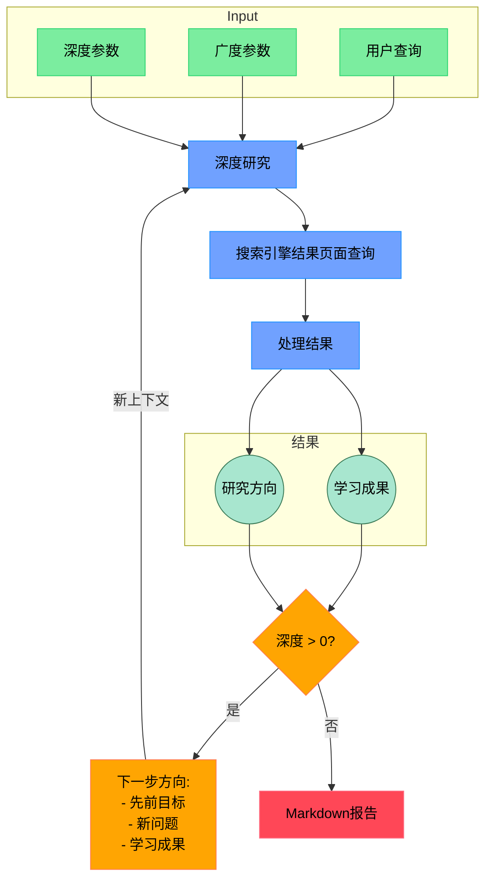

# Shandu: 面向综合知识合成的先进AI研究系统
[[EN]](README.md) | [[中文]](README_zh.md)

Shandu是一款尖端的AI研究助手，通过先进的语言模型、智能网页抓取和迭代探索，对任何主题进行深度多源研究，生成结构完善、引用规范的综合性报告。

[](LICENSE)
[](https://www.python.org/downloads/)

## 🔍 什么是Shandu？

Shandu是基于LangGraph状态工作流的智能研究系统，通过递归探索主题的先进算法，自动化完成从初始查询澄清到深度内容分析与报告生成的完整研究流程。

### 核心应用场景

- **学术研究**：生成文献综述、背景资料和复杂主题分析
- **市场情报**：分析行业趋势、竞争策略和市场机会
- **内容创作**：产出规范引用的研究性文章、博客和报告
- **技术探索**：跟踪新兴技术、创新突破和研发进展
- **政策分析**：研究法规要求、合规框架和政策影响
- **竞争分析**：跨行业比对产品、服务和公司战略

## ⚙️ Shandu的工作原理



## 🌟 核心特性

- **智能基于状态的工作流**：利用 LangGraph 实现结构化的、逐步进行的研究过程，并具有清晰的状态转换。
- **迭代深度探索**：以动态的深度和广度递归探索主题，根据发现的信息进行自适应调整。
- **多源信息综合**：分析来自搜索引擎、网页内容和结构化知识库的数据。
- **增强型网页抓取**：支持动态 JS 渲染、内容提取以及符合道德的抓取实践。
- **智能来源评估**：自动评估来源的可信度、相关性和信息价值。
- **内容分析流水线**：使用先进的自然语言处理 (NLP) 技术提取关键信息、识别模式并综合研究结果。
- **全面的报告生成**：创建详细且结构良好的报告，包含规范的引用和主题组织。
- **并行处理架构**：实现并发操作，以高效执行多查询任务。
- **自适应搜索策略**：根据已发现的信息和知识空白动态调整搜索查询。
- **完整的引用管理**：以多种格式规范化所有来源的引用，确保正确归属。


## 🚀 Installation

```bash
# Install from PyPI
pip install shandu

# Install from source
git clone https://github.com/jolovicdev/shandu.git
cd shandu
pip install -e .
```

## 🏁 Quick Start

```bash
# 配置 API 设置（支持多种大语言模型提供商）
shandu configure

# 运行综合研究
shandu research "你的研究查询内容" --depth 2 --breadth 4 --output report.md

# 借助网页抓取功能进行快速 AI 搜索（你无需使用 Perplexity！）
shandu aisearch "现任美国总统是谁？" --detailed

# 基本的多引擎搜索
shandu search "你的搜索查询内容"
```

## 📚 详细用法

### Research Command

```bash
shandu research "你的研究query" \
    --depth 3 \                # 探索深度 (1 - 5，默认值：2)
    --breadth 5 \              # 并行查询数量 (2 - 10，默认值：4)
    --output report.md \       # 保存到文件而非终端输出
    --verbose                  # 显示详细进度
```

### 示例报告

你可以在 `examples` 目录中找到示例报告：

1. **量子计算、合成生物学与气候建模的交汇点**
   ```bash
   shandu research "量子计算、合成生物学与气候建模的交汇点" --depth 3 --breadth 3 --output examples/o3-mini-high.md
   ```

### AI 搜索命令与抓取功能

```bash
shandu aisearch "你的搜索query" \
    --engines "google,duckduckgo" \  # 以逗号分隔的搜索引擎列表
    --max-results 15 \               # 返回的最大结果数量
    --output results.md \            # 保存到文件而不是终端
    --detailed                       # 生成详细分析
```

## 💻 Python API

```python
from shandu.agents import ResearchGraph
from langchain_openai import ChatOpenAI

# 如果需要，使用自定义 LLM 初始化
llm = ChatOpenAI(model="gpt-4")

# 初始化研究图
researcher = ResearchGraph(
    llm=llm,
    temperature=0.5
)

# 执行deep research
results = researcher.research_sync(
    query="Your research query",
    depth=3,       # research递归的深度
    breadth=4,     # 并行探索的查询数量
    detail_level="high"
)

# 打印或保存结果
print(results.to_markdown())
```

## 🧩 高级架构

Shandu 实现了一个复杂的多阶段研究流程：

1. **查询澄清**：通过交互式问题理解研究需求
2. **研究规划**：制定战略计划以全面覆盖主题
3. **迭代探索**：
   - 基于知识空白生成智能查询
   - 使用多引擎搜索并行执行
   - 搜索结果的相关性过滤
   - 智能网页抓取与内容提取
   - 来源可信度评估
   - 信息分析与综合
   - 反思发现以识别空白
4. **报告生成**：
   - 主题提取与组织
   - 多步骤报告增强
   - 引用格式化与管理
   - 扩展章节以实现全面覆盖

## 🔌 支持的搜索引擎与来源

- Google 搜索
- DuckDuckGo
- 维基百科
- ArXiv（学术论文）
- 可添加自定义搜索引擎

## 📊 技术能力

- **动态 JS 渲染**：处理 JavaScript 密集型网站
- **内容提取**：识别并提取网页的主要内容
- **并行处理**：并发执行搜索与抓取
- **缓存**：高效缓存搜索结果与抓取内容
- **速率限制**：尊重网络资源访问规则
- **Robots.txt 合规性**：遵循道德抓取实践
- **灵活的输出格式**：Markdown、JSON、纯文本

## 📜 许可证与信息

注意：这只是一个想法，我需要贡献者！这是一个让我深入研究 LangChain 和 LangGraph 的项目！  
该项目采用 MIT 许可证授权——详情请参阅 [LICENSE](LICENSE) 文件。